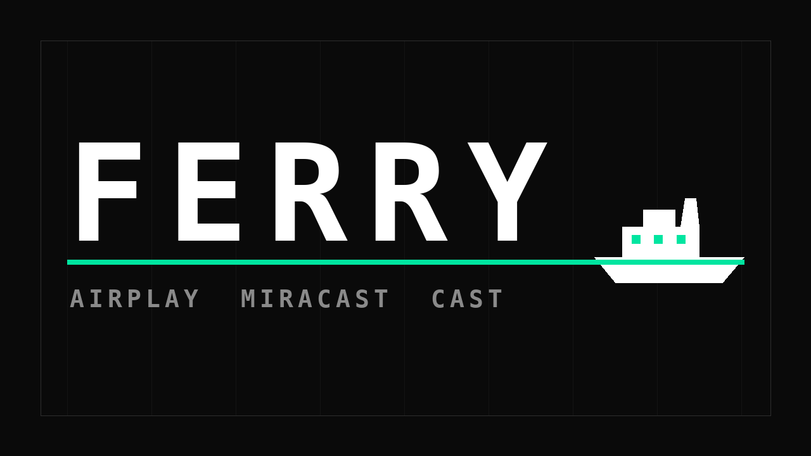

# Ferry

**A screen-mirroring receiver for Amazon Fire TV and Android TV.** Compatible with the
AirPlay 2 protocol, so an iPhone, iPad, or Mac can mirror to a TV stick that has no
native support for it. Everything happens on your local network — Ferry needs no
internet connection and no account.

A ferry carries something across to the other side. That's the job.

```
 iPhone / iPad / Mac                Fire TV / Android TV
 ┌────────────────┐    local Wi-Fi   ┌──────────────────────┐
 │  [Your Screen] │ ───────────────► │   [Your TV Screen]   │
 └────────────────┘                  └──────────────────────┘
   Screen Mirroring →                        Ferry
   Select "Ferry" →
   Done.
```

---

## Provenance

**Ferry is a derivative work, and the AirPlay protocol stack is not original to it.** It
began as [mazer666/PhairPlay](https://github.com/mazer666/PhairPlay) — RTSP handling, the
AirPlay 2 handshake, mDNS advertisement, the MediaCodec pipeline. That lineage runs back
through [UxPlay](https://github.com/FDH2/UxPlay) to
[RPiPlay](https://github.com/FD-/RPiPlay); the FairPlay code originates in
[EstebanKubata/playfair](https://github.com/EstebanKubata/playfair); the ALAC decoder is
Apple's own open-source code; and the protocol is documented by
[openairplay/airplay-spec](https://github.com/openairplay/airplay-spec).

Every attribution obligation is spelled out in [`NOTICE`](NOTICE). None of it is optional
— GPLv3 requires it, and it stays regardless of how far the project diverges.

### What Ferry has changed since

Roughly 2,000 lines across 42 files, 13 of them new, on top of that baseline. The parts
worth naming:

| Area | Change |
|---|---|
| **Screensaver** | The Fire TV screensaver no longer interrupts an active session. This is why the project exists. [Details below.](#the-screensaver-fix) |
| **Video pipeline** | Asynchronous MediaCodec decode, realtime codec priority, low-latency mode, a shallow bounded frame queue that sheds non-reference frames first, in-place AVCC→Annex-B conversion, and a reused read buffer. Latency and GC pressure, both reduced deliberately. |
| **Picture** | Smart fill (crop a capped slice instead of showing black bars), optional 1440p advertisement for sharper text. |
| **Audio** | Correct dB→amplitude volume mapping, volume on the legacy RAOP path, and an optional compressing loudness boost for quiet sources. |
| **AirPlay modes** | "Always mirror the screen" — withholds the video-URL capability bit so senders stop popping out into their own player. |
| **Security** | Hardened LAN-facing parsers (RTSP reader stack overflow, unbounded FU-A reassembly, config-frame bounds), SRP PIN pairing with a persistent lockout, scoped-down location permissions. |
| **Packaging** | Release APK cut by more than half — native libraries are now stripped, and the Fire TV build ships ARM only. |
| **Licensing** | GPLv3 instead of Apache 2.0, to match the provenance of the native code. Missing headers added to `cpp/playfair/`. [Details below.](#licensing--gplv3-and-why-it-changed) |
| **Provenance** | The baseline was audited before anything was changed ([`AUDIT.md`](AUDIT.md)), and tagged releases now build from source in CI — upstream had no release workflow. |

Full history in [`CHANGELOG.md`](CHANGELOG.md). As of 6.0.0 the Fire TV build is
AirPlay-only: Miracast and Google Cast were removed from it because neither ever worked
there, and both were on by default. Cast cannot work without Google Play Services, and
Miracast gated on a runtime permission Ferry never requested — so it reported an error on
every Fire TV, on every boot, without ever advertising. Both remain in the `googletv`
flavor, where Cast Connect is a real implementation.

### Licensing — GPLv3, and why it changed

Upstream declared Apache 2.0. That declaration did not cover the code actually being
distributed.

`app/src/main/cpp/playfair/` is the FairPlay key-decryption implementation from
EstebanKubata/playfair, redistributed through RPiPlay. **Both of those projects are
GPLv3.** GPLv3 code cannot be relicensed under Apache 2.0; the reverse direction is
fine. So GPLv3 is the only license the combined work can validly carry, and Ferry is
GPLv3.

Apple's ALAC decoder in `cpp/alac/` remains under Apache 2.0 and **keeps its copyright
headers verbatim** — the two licenses combine fine in one binary, with the
Apache-licensed files retaining their own notices. No upstream copyright header has been
removed or altered anywhere in this repository.

One point of fact, since it is easy to assume otherwise: **upstream did not strip those
license headers.** RPiPlay's own copies carry no per-file header either; RPiPlay conveys
its license at the project level. The omission was inherited, not introduced. Ferry adds
the headers to stop it propagating further.

This is a good-faith reading, not legal advice. See [`NOTICE`](NOTICE) for the full
reasoning — and talk to a lawyer if you plan to redistribute commercially.

---

## Install

Prebuilt APKs are on the [Releases](../../releases) page, built from a tagged commit by
CI. Building it yourself is strictly better, and not hard — see below.

On your Fire TV: **Settings → My Fire TV → Developer Options** → enable *ADB debugging*
and *Apps from Unknown Sources*. Find the IP under **Settings → My Fire TV → About →
Network**.

```bash
adb connect 192.168.1.42:5555
adb install -r ferry-v6.7.0-firetv.apk
```

Accept the authorization prompt on the TV the first time. Then launch **Ferry** from the
Fire TV home screen.

**To mirror:** on iPhone/iPad, Control Center → **Screen Mirroring** → *Ferry*. On a Mac,
the AirPlay/Screen Mirroring icon in the menu bar or Control Center → *Ferry*.

Ferry must be running, and the sender must be on the same network.

To advertise a different name, set **Settings → Device Name** in the app.

---

## Build from source

Requires **JDK 17**, Android SDK **platform 35** and **build-tools 35.0.0**, **NDK
28.2.13676358**, and **CMake 3.22.1**. The NDK and CMake versions are pinned in
`app/build.gradle.kts`; the Gradle wrapper fetches Gradle itself.

```bash
git clone https://github.com/BPRVT/Ferry.git
cd Ferry
echo "sdk.dir=$HOME/Library/Android/sdk" > local.properties
./gradlew assembleFiretvDebug
```

The APK lands in `app/build/outputs/apk/firetv/debug/`.

```bash
./gradlew :test-runner:test        # fast JVM protocol tests — no emulator needed
./gradlew :app:lintFiretvDebug     # lint (warnings are errors)
```

Two product flavors: `firetv` (minSdk 25, application ID `com.ferry.receiver`) and
`googletv` (minSdk 29). Miracast and Cast are both scoped to `googletv`, behind a
per-flavor `OptionalProtocols` seam — **the Fire TV APK contains no Miracast, Cast, or
Google Play Services code at all**, which is verified rather than assumed (see the audit
summary). Tests for those protocols live in `src/testGoogletv/`, because `src/test/` is
compiled against every variant.

Placeholder artwork is generated by `tools/generate-artwork.py`; replace the PNGs under
`app/src/main/res/` with your own whenever you like.

---

## The screensaver fix

**The bug:** during active mirroring, the Fire TV screensaver would activate and
interrupt playback.

**The cause:** nothing in the codebase ever asked for the screen to stay on. A repo-wide
search for `FLAG_KEEP_SCREEN_ON`, `keepScreenOn`, `WakeLock`, and `PowerManager` returned
zero hits, and `WAKE_LOCK` was not even declared in the manifest. Mirroring renders
decoded frames straight to a `SurfaceView` with no user input, so as far as the OS is
concerned the device is idle and the normal idle timer runs to completion.

**The fix:** `MainActivity` sets `FLAG_KEEP_SCREEN_ON` while a session is active and
clears it when one is not.

A window flag, not a wake lock — deliberately. It is scoped to the window, so the system
drops it automatically if the app is killed or crashes. A leaked
`SCREEN_BRIGHT_WAKE_LOCK` would pin the TV awake until reboot, which is a worse bug than
the one being fixed. It also needs no `WAKE_LOCK` permission, so Ferry's permission set
is unchanged.

**Scoped to real sessions.** The flag is driven off existing session state through a
single shared predicate (`isSessionActive`) that also decides which overlay is on screen,
so the two cannot drift apart. It covers mirroring, audio-only playback, a displayed
photo, and a pairing PIN. **When Ferry sits idle waiting for a connection, normal
screensaver and sleep behavior resume.**

Abrupt disconnects — the sender walking out of Wi-Fi range — are handled: the RTSP
handler's `finally` block runs on the socket exception and funnels into the same state
transition as a clean `TEARDOWN`.

### Fire OS caveat — please verify this on your device

**Whether the standard Android flag is sufficient on Fire OS specifically cannot be
determined from source, and I'm not going to pretend otherwise.**

`FLAG_KEEP_SCREEN_ON` is the correct, documented Android mechanism and prevents the
display timing out on stock Android TV. Fire OS is a fork, and its screensaver is a
system-level feature with its own settings entry (**Settings → Display & Sounds →
Screensaver**). Whether that timer always defers to an app holding the flag is a
device-behavior question that varies across Fire OS versions and can only be answered on
the hardware.

So test it. Start a mirroring session and leave it past your screensaver timeout.

- **Nothing happens** → the flag works on your device. Done.
- **The screensaver still appears** → the OS is overriding the flag. Set **Settings →
  Display & Sounds → Screensaver → Start after → Never** as a workaround, and please open
  an issue with your Fire OS version.

Ferry deliberately does **not** hack around a system-level override by faking input
events or holding a screen-bright wake lock. Those approaches are fragile and risk
leaving the TV awake permanently — the exact failure mode being avoided.

### Manual test plan

1. Start mirroring from an iPhone or Mac.
2. Leave it past your screensaver timeout — set the timeout to 2 minutes to make this
   quick. **Expected: nothing happens, mirroring continues.**
3. Stop mirroring on the sender; leave the TV on Ferry's idle waiting screen.
4. Wait past the timeout again. **Expected: the screensaver appears normally.** ← the
   case that matters most.
5. Repeat step 1, then walk the phone out of Wi-Fi range instead of disconnecting
   cleanly. **Expected: the screensaver returns after the timeout.**

---

## Security

Ferry is a **LAN-only receiver**: it opens listening sockets and parses binary protocol
data from whatever connects to them. **Run it on a home network you control**, not on
shared or open Wi-Fi.

> **The pairing PIN is off by default.** Out of the box, any device that can reach the
> subnet can mirror to the TV without anyone touching it — the only access control is your
> network perimeter. That is a deliberate trade for an appliance driven by a remote
> control on a network its owner already trusts. **If the TV shares a network with guests,
> or sits on shared or open Wi-Fi, turn on Settings → Require pairing PIN.** Upgrading
> won't silently disable a PIN you already set; see [`SECURITY.md`](SECURITY.md).

Full threat model and reporting process in [`SECURITY.md`](SECURITY.md).

### Audit summary

The upstream baseline was audited before any changes were made. Full writeup in
[`AUDIT.md`](AUDIT.md). The short version:

**Verdict: no malware, no backdoor, no exfiltration.**

- **Permissions** are minimal and justified. As of 6.0.0 the Fire TV build no longer
  requests `ACCESS_FINE_LOCATION`, `ACCESS_COARSE_LOCATION`, `NEARBY_WIFI_DEVICES` or
  `CHANGE_WIFI_STATE` at all — Android gates Wi-Fi P2P (Miracast) discovery behind them,
  and Miracast is no longer in that build. They remain in the `googletv` manifest, where
  Miracast does exist. There is no `LocationManager`, no location provider, and no
  geocoding anywhere in the tree; the app never reads a coordinate.
- **Dependencies:** zero analytics, zero ad SDKs, zero crash reporters. The only vendor
  SDK is the Google Cast receiver, scoped to `googletv`. Verified absent from the Fire TV
  APK — all 10 dex files scanned, **zero** Cast references.
- **Egress:** no hardcoded remote endpoint exists anywhere in the codebase. There is
  exactly one outbound HTTP call site, and it targets the *sender's* own mDNS-resolved
  LAN address — that is DACP, the reverse-control channel letting your TV remote pause
  your iPhone. The host is never a constant.
- **Dynamic code:** two `System.loadLibrary` calls, for libraries built from source in
  this repo. Nothing else — no reflection on network classes, no `Runtime.exec`, and no
  `Base64.decode` call sites at all, so there is no decode-and-execute pattern.
- **The FairPlay native code** was compared **byte-for-byte** against RPiPlay and
  cross-checked against UxPlay. Five of seven files hash identical to upstream —
  **including the 483 KB lookup-table header and the 21 KB cipher core**, which is
  exactly where a payload could realistically hide. The two that differ carry only
  strict-aliasing and unaligned-access fixes, quoted in full in the audit. They add no
  behavior.
- **Both JNI bridges** validate array lengths against attacker-controlled input before
  touching native memory.

Not covered: no fuzzing was performed, and Apple's ALAC decoder and the
reverse-engineered FairPlay C were not audited internally. The mitigation is the bounds
checking at the JNI boundary.

**One thing static analysis cannot prove** is whether the running app is genuinely
internet-free. You can settle that in five minutes: block the Fire TV's WAN access at
your router, leave LAN intact, and mirror. If it works, the claim is confirmed by
observation rather than by trusting a source review.

---

## Features

- **AirPlay 2 screen mirroring** from macOS 12+ and iOS/iPadOS 16+ — H.264 hardware
  decode via `MediaCodec`, decoded asynchronously and rendered as soon as each frame is
  ready.
- **Audio** — AAC-ELD / AAC-LC / ALAC, with NTP-based A/V sync.
- **HomeKit-style pairing**, with an optional on-screen PIN (off by default — see
  [Security](#security)).
- **Photos** via AirPlay, and **video URL mode** (`POST /play`), which can be turned off
  so senders always mirror instead.
- **DACP reverse remote** — the TV remote can play/pause/skip what the sender is playing.
- Miracast and Google Cast (**`googletv` flavor only**): control plane implemented, media
  path not. Inherited in that state and not worked on since. Removed from the Fire TV
  build in 6.0.0 — see the changelog for why neither could ever have worked there.

### Settings

| Setting | Default | What it does |
|---|---|---|
| Device name | `Ferry` | The name shown in the sender's AirPlay picker. |
| Require pairing PIN | **Off** | Show a code on the TV that must be entered to connect. Off means anyone on the network can mirror. |
| Always mirror the screen | Off | Stops apps opening their own player on the TV. |
| Higher resolution (1440p) | Off | Sharper text, more decode work. |
| Smart fill | On | Fill the screen by cropping a capped slice rather than showing black bars. |
| Mirroring audio | On | Accept the audio stream that accompanies a mirror session. |
| Audio boost | Off | Up to +12 dB of compressing gain for quiet sources. |
| Keep receiving when closed | **Off** | Stay visible to senders after you leave Ferry. Off means Ferry only receives while it is open — see [Security](#security). |
| Start on boot | Off | Launch the receiver when the TV starts. Implies "Keep receiving when closed". |
| Debug overlay | Off | On-screen HUD: pipeline state and counters — decoder status, frames shown, time since the last frame arrived and was displayed, plus any watchdog recoveries. |

---

## Documentation

- [`ARCHITECTURE.md`](ARCHITECTURE.md) — how a session works end to end, the JNI
  boundary, and where session state lives. Start here before modifying anything.
- [`AUDIT.md`](AUDIT.md) — the full security audit.
- [`SECURITY.md`](SECURITY.md) — threat model and vulnerability reporting.
- [`NOTICE`](NOTICE) — provenance and licensing.
- [`CHANGELOG.md`](CHANGELOG.md) — every release, and why each change was made.
- [`PROGRESS.md`](PROGRESS.md) — build log.
- [`docs/spec/TECHNICAL_SPEC.md`](docs/spec/TECHNICAL_SPEC.md) — protocol reference. §8
  (the `features` bitmask) has been rebuilt against the two public AirPlay references; the
  rest is inherited and has not been re-verified to that standard.

## License

**GPLv3.** See [`LICENSE`](LICENSE) and [`NOTICE`](NOTICE).

Apple's ALAC decoder in `app/src/main/cpp/alac/` is Apache 2.0 and retains its own
headers.

## Trademarks

AirPlay, Apple, and macOS are trademarks of Apple Inc. **Ferry is not affiliated with,
authorized by, endorsed by, or sponsored by Apple Inc.** Ferry implements a protocol
compatible with AirPlay; it does not use the AirPlay name as its own.
